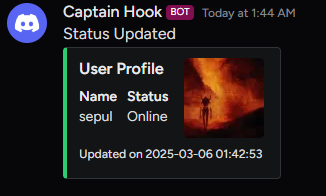

# steam-activity-notifier

Python script fetches the Steam users status and game information then sends updates to a Discord channel via a webhook



## libs

```bash
pip install requests asyncio
```

## api keys, etc.

1. Replace `STEAM_API_KEY`, `STEAM_USER_ID` and `DISCORD_WEBHOOK_URL`

## how it works

- script automaticly checks steam user status and current game every 10 sec.
- if there is a change in user status or game activity it sends a message to discord channel
- message includes steam user name, profile pic and game info (if user in game )

